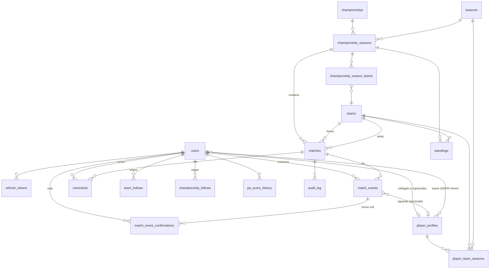

# DATABASE.md — RugbyTracker Community

**Owner:** Laura (DB-1)  
**Ownership directory:** `database/`  
**Stack:** MySQL 8 · phpMyAdmin · Docker Compose

---

## Responsabilità

| Attività | Note |
|----------|------|
| Migrazioni SQL (`database/migrations/`) | Numerazione progressiva `NNN_slug.sql` |
| Seeds (`database/seeds/`) | `seeds/test/` per E2E, root per prod/dev |
| Ottimizzazione query | Indici, EXPLAIN, query lente segnalate da BE |
| Audit log | Tabella immutabile per partite `CERTIFICATA` |
| Backup | Script e documentazione procedura |
| phpMyAdmin | Accesso `http://localhost:8080` in locale |
| Approvazione schema BE | Nessuna modifica allo schema senza PR approvata da BE + DB-1 + TL |

---

## Setup locale

```bash
cp .env.example .env   # compila DB_*, JWT_SECRET, REDIS_URL
docker compose up --build
```

Le migrazioni in `database/migrations/` vengono applicate automaticamente da MySQL al primo avvio via `docker-entrypoint-initdb.d`.

> **Attenzione:** MySQL ignora sottodirectory in `docker-entrypoint-initdb.d`. Per i compose dedicati (es. test) i file vanno montati singolarmente con prefisso ordinante — vedi `docker-compose.test.yml`.

---

## Convenzioni

### Naming
- Tabelle: `snake_case`, **plurali** (`match_events`, `user_profiles`, `refresh_tokens`)
- Colonne: `snake_case`
- Chiavi primarie: sempre `id INT AUTO_INCREMENT`
- Foreign key: `fk_<tabella>_<riferimento>` (es. `fk_refresh_tokens_user`)
- Indici unici: `uq_<tabella>_<colonna>` (es. `uq_users_email`)
- Indici non unici: `idx_<tabella>_<colonna>`

### Migrazioni
- File in `database/migrations/` con naming `NNN_descrizione_breve.sql`
- Numerazione continua da `001` — **mai riusare o rinominare un numero esistente**
- Ogni file è idempotente dove possibile (`CREATE TABLE IF NOT EXISTS`, `ALTER TABLE IF NOT EXISTS`)
- Breaking change (drop colonna, cambio tipo) → PR obbligatoria approvata da BE + TL prima del merge

### Charset
Tutti i `CREATE TABLE` usano `ENGINE=InnoDB DEFAULT CHARSET=utf8mb4 COLLATE=utf8mb4_unicode_ci`.

---

## Schema corrente (Fase 0 — Giugno 2026)

### Tabelle esistenti

| Migrazione | Tabella | Descrizione |
|------------|---------|-------------|
| `001` | `users` | Utenti, ruoli, livello, PA score, flag GDPR |
| `002` | `refresh_tokens` | Token opachi SHA-256 con rotazione single-use |
| `003` | ALTER `users` | Aggiunge `google_id VARCHAR(255) NULL UNIQUE` |
| `004` | ALTER `users` | Rende `password_hash` nullable (utenti solo OAuth) |
| `005` | ALTER `users` | Aggiorna `role` ENUM → `superadmin`, `admin`, `user_pro`, `user` |
| `006` | `teams` | Squadre: nome, città, stato verifica, FK utente che la gestisce |
| `007` | `championships` | Campionati: nome, livello ENUM, regione |
| `008` | `seasons` | Stagioni sportive (es. `2025/26`) |
| `009` | `championship_seasons` | Join campionato × stagione, con gruppi/gironi opzionali |
| `010` | `championship_season_teams` | Iscrizioni squadre a una specifica edizione del campionato |

### `users`

| Colonna | Tipo | Note |
|---------|------|------|
| `id` | INT PK AUTO_INCREMENT | |
| `username` | VARCHAR(30) NOT NULL UNIQUE | |
| `email` | VARCHAR(255) NOT NULL UNIQUE | |
| `google_id` | VARCHAR(255) NULL UNIQUE | OAuth Google |
| `password_hash` | VARCHAR(255) NULL | NULL per utenti OAuth-only |
| `role` | ENUM | `superadmin`, `admin`, `user_pro`, `user` — vedi tabella ruoli sotto |
| `level` | TINYINT DEFAULT 0 | 0–4 solo per `user` e `user_pro` — vedi tabella livelli |
| `pa_score` | INT DEFAULT 0 | Punteggio Affidabilità |
| `parental_consent` | BOOLEAN DEFAULT FALSE | GDPR minori |
| `guardian_managed` | BOOLEAN DEFAULT FALSE | Profilo gestito dal tutore |
| `created_at` / `updated_at` | TIMESTAMP | |

#### Ruoli utente

| `role` | Chi è | Privilegi chiave |
|--------|-------|-----------------|
| `superadmin` | Dev / staff piattaforma | Accesso completo, configurazione, gestione utenti |
| `admin` | Amministrazione squadra (Admin Squadra) | Gestione pagina squadra, conferma risultati, certificazione |
| `user_pro` | Utente pagante con funzioni sbloccate | Inserimento senza delay, peso maggiore nel consensus, profilo giocatore/arbitro |
| `user` | Utente normale | Lettura, inserimento eventi (livello ≥ 1), commenti |

> **Nota migrazione:** La migrazione 001 ha un ENUM obsoleto (`user`, `player`, `team`, `referee`, `editor`, `moderator`, `superadmin`). Serve **migrazione 005** per aggiornarlo ai 4 ruoli canonici. Da fare prima delle tabelle Fase 0 che usano FK su `users.role`.

#### Livelli utente (solo `user` e `user_pro`)

| Livello | Nome | Sblocca |
|---------|------|---------|
| 0 | Spettatore | Lettura + commenti |
| 1 | Tifoso | Inserimento eventi live |
| 2 | Cronista | Inserimento senza delay |
| 3 | Redattore | Moderazione leggera |
| 4 | Verificatore | Conferma dati, gestione campionati |

---

### `refresh_tokens`

| Colonna | Tipo | Note |
|---------|------|------|
| `id` | INT PK AUTO_INCREMENT | |
| `user_id` | INT NOT NULL | FK → `users.id ON DELETE CASCADE` |
| `token_hash` | VARCHAR(64) NOT NULL UNIQUE | SHA-256 del token opaco |
| `expires_at` | DATETIME NOT NULL | 30 giorni dalla creazione |
| `created_at` | TIMESTAMP | |

---

---

### `teams`

| Colonna | Tipo | Note |
|---------|------|------|
| `id` | INT UNSIGNED PK AUTO_INCREMENT | |
| `name` | VARCHAR(150) NOT NULL | |
| `short_name` | VARCHAR(20) NOT NULL | |
| `city` | VARCHAR(100) NOT NULL | |
| `region` | VARCHAR(100) NULL | |
| `logo_url` | VARCHAR(500) NULL | Punta a storage S3-compatible |
| `is_verified` | BOOLEAN DEFAULT FALSE | Verifica completata da superadmin |
| `claimed_by_user_id` | INT NULL | FK → `users.id ON DELETE SET NULL` — NULL = squadra non reclamata |
| `created_at` / `updated_at` | DATETIME | |

> `claimed_by_user_id` è `INT` (non UNSIGNED) per corrispondere al tipo di `users.id`.

---

### `championships`

| Colonna | Tipo | Note |
|---------|------|------|
| `id` | INT UNSIGNED PK AUTO_INCREMENT | |
| `name` | VARCHAR(200) NOT NULL | |
| `short_name` | VARCHAR(50) NULL | |
| `level` | ENUM NOT NULL | `serie_a_elite`, `serie_a`, `serie_b`, `serie_c`, `under_18`→`under_6`, `regional`, `other` |
| `region` | VARCHAR(100) NULL | NULL = campionato nazionale |
| `created_at` / `updated_at` | DATETIME | |

---

### `seasons`

| Colonna | Tipo | Note |
|---------|------|------|
| `id` | INT UNSIGNED PK AUTO_INCREMENT | |
| `name` | VARCHAR(10) NOT NULL UNIQUE | Formato `YYYY/YY` (es. `2025/26`) |
| `start_date` | DATE NOT NULL | |
| `end_date` | DATE NOT NULL | |
| `is_current` | BOOLEAN DEFAULT FALSE | Al massimo una riga TRUE — invariante applicativa |
| `created_at` | DATETIME | |

---

### `championship_seasons`

| Colonna | Tipo | Note |
|---------|------|------|
| `id` | INT UNSIGNED PK AUTO_INCREMENT | |
| `championship_id` | INT UNSIGNED NOT NULL | FK → `championships.id ON DELETE RESTRICT` |
| `season_id` | INT UNSIGNED NOT NULL | FK → `seasons.id ON DELETE RESTRICT` |
| `gruppo` | VARCHAR(100) NOT NULL DEFAULT '' | Stringa vuota se non applicabile (no NULL — vedi note design) |
| `girone` | VARCHAR(100) NOT NULL DEFAULT '' | Stringa vuota se non applicabile |
| `created_at` / `updated_at` | DATETIME | |
| UNIQUE | `(championship_id, season_id, gruppo, girone)` | Impedisce duplicati campionato/stagione/girone |

> `''` invece di NULL per `gruppo`/`girone`: MySQL tratta due NULL come distinti in UNIQUE index, rendendo impossibile bloccare duplicati per campionati senza gironi.

---

### `championship_season_teams`

| Colonna | Tipo | Note |
|---------|------|------|
| `id` | INT UNSIGNED PK AUTO_INCREMENT | |
| `championship_season_id` | INT UNSIGNED NOT NULL | FK → `championship_seasons.id ON DELETE RESTRICT` |
| `team_id` | INT UNSIGNED NOT NULL | FK → `teams.id ON DELETE RESTRICT` |
| `created_at` | DATETIME | |
| UNIQUE | `(championship_season_id, team_id)` | Una squadra una volta per edizione |

---

## Roadmap DB per fase

### Fase 0 — Giugno 2026 (in corso)
- [x] Schema ER v1: `users`, `refresh_tokens`
- [x] **Migrazione 005:** aggiorna `users.role` ENUM → `superadmin`, `admin`, `user_pro`, `user`
- [x] Tabelle: `teams`, `championships`, `seasons`, `championship_seasons`, `championship_season_teams`
- [x] Migrazioni 006–010 con seed dati di test E2E
- [ ] Seed squadre italiane da CSV (`dati csv/squadre_rugby_italia_2025_26.csv`)
- [ ] Migrazione `date_of_birth` su `users` (richiede advisor — GDPR §4.5)
- [ ] Setup phpMyAdmin + documentazione schema

### Fase 1 — Luglio 2026
- [ ] Schema v2: `matches`, `match_events` (meta, trasformazione, calcio, drop, cartellino)
- [ ] Logica bonus point FIR in `standings` (trigger o view)
- [ ] Migrazioni + seed partite di test

### Fase 2 — Agosto 2026
- [ ] Schema v3: `comments`, `follows`, `user_reliability_scores`
- [ ] Tabelle statistiche aggregate: `player_stats`, `team_stats`
- [ ] Audit log partite certificate (tabella immutabile)

---

## Regole di dominio che impattano lo schema

### Stati partita
`PROGRAMMATA` → `IN CORSO` → `TERMINATA` → `CERTIFICATA`

Ogni modifica a eventi di partite con stato `CERTIFICATA` **deve** produrre un record nell'audit log (tabella immutabile — solo INSERT, mai UPDATE/DELETE).

### Affidabilità eventi
| Livello | Condizione |
|---------|-----------|
| Community | Default — non verificato |
| Confermato | Consensus ≥ 3 utenti distinti |
| Verificato | Inserito da utente premium |
| Certificato | Fonte ufficiale / Admin Squadra di entrambe le squadre |

### GDPR — minori (PRD §4.5)
- `parental_consent = FALSE` → non esporre nome e cognome per intero
- `guardian_managed = TRUE` → ogni write deve verificare che il richiedente sia il tutore associato
- Nessun dato personale di giocatori minorenni (`< 18 anni`) esposto senza `parental_consent = TRUE`

> **Regola**: qualsiasi migrazione o query che tocca dati di minori richiede chiamata ad `advisor` prima di scrivere.

### Punteggio Affidabilità (PA)
- Campo `pa_score` in `users` — aggiornato da job asincrono BE (Fase 2)
- Sale con contributi corretti, scende con inserimenti contestati
- Controlla soglie anti-spam — la logica risiede nel BE, il DB espone solo il valore

---

## Seeds

| File | Ambiente | Contenuto |
|------|----------|-----------|
| `seeds/test/001_e2e_users.sql` | E2E / test | 2 utenti: `e2e@test.local` (user) e `admin@test.local` (superadmin), password `E2EPass123!` bcrypt cost 12 |

Il seed squadre italiane verrà generato dal CSV `dati csv/squadre_rugby_italia_2025_26.csv` (176 squadre, stagione 2025/26). Documentazione struttura colonne in `dati csv/documentazione_csv_rugby_italia_2025_26.md`.

---

## Collaborazione cross-layer

```
BE propone migrazione (branch database/laura/...) 
  → DB-1 approva e ottimizza 
  → PR approvata da BE + DB-1 + TL 
  → merge
```

- Nessuna modifica allo schema DB senza PR approvata da BE + DB-1 + TL
- Nomi tabelle e colonne concordati con BE prima di scrivere la migrazione (vedi `docs/glossario.md`)
- Per indici e ottimizzazioni query: BE apre issue/PR, Laura valuta e implementa

---

## Quando chiamare advisor

Prima di scrivere qualsiasi migrazione che riguarda:
- Transizioni stato partita (`TERMINATA` → `CERTIFICATA`) o struttura audit log
- Dati utenti minorenni (`parental_consent`, `guardian_managed`)
- Foreign key con vincoli non ovvi, strutture con integrità complessa

Riferimento: sezione **Advisor** in `CLAUDE.md`.

---

## Panoramica complessità DB

**18 tabelle** totali, complessità **medio-alta**. Gestibile se si parte dalla struttura centrale.

### I 4 livelli concentrici

```
CAMPIONATO / STAGIONE          ← il contenitore
          ↓
       PARTITA                 ← l'evento centrale
          ↓
   EVENTO DI GIOCO             ← cosa succede in campo
          ↓
 UTENTI / GIOCATORI            ← chi lo fa / chi lo registra
```

Quasi ogni tabella è figlia o nipote di `matches`. Capito questo, il resto si legge da solo.

### Le 18 entità spiegate

#### Gruppo 1 — Chi usa la piattaforma

| Tabella | Cosa rappresenta |
|---------|-----------------|
| `users` | Account della piattaforma |
| `refresh_tokens` | Sessioni di login |

#### Gruppo 2 — La struttura del campionato

| Tabella | Cosa rappresenta |
|---------|-----------------|
| `championships` | "Serie B Rugby" — il nome del torneo |
| `seasons` | "Stagione 2025/26" — l'anno |
| `championship_seasons` | "Serie B Rugby nella stagione 2025/26" — join tra i due |
| `teams` | Le squadre iscritte |
| `championship_season_teams` | "Questa squadra gioca in questa edizione del torneo" |

> **Perché non basta `championships`?** La Serie B del 2025 e la Serie B del 2026 sono la stessa competizione ma con squadre diverse, calendari diversi, classifiche separate. La stagione è una dimensione separata obbligatoria.

#### Gruppo 3 — Le partite

| Tabella | Cosa rappresenta |
|---------|-----------------|
| `matches` | Una singola partita (data, ora, squadra A vs B) |
| `match_events` | Ogni cosa che succede: meta, cartellino, calcio... |
| `match_event_confirmations` | Gli utenti votano se un evento è corretto (consensus) |
| `standings` | La classifica — calcolata dai risultati, non inserita a mano |

> **Nota rugby:** in rugby la classifica ha i "bonus point" — punti extra se segni 4 mete in una partita o perdi di misura (≤7 punti). Questo rende `standings` più complessa di una classifica normale. Probabilmente sarà una VIEW derivata, non una tabella che scrivi direttamente.

#### Gruppo 4 — I giocatori

| Tabella | Cosa rappresenta |
|---------|-----------------|
| `player_profiles` | La "scheda" del giocatore (statistiche, ruolo in campo) |
| `player_team_seasons` | "Questo giocatore era in questa squadra nel 2025/26" |

> **Attenzione:** `player_profiles` è **separata** da `users`. Un giocatore può esistere nel DB (creato dalla community) senza avere un account. Se poi si registra, si "collega" al suo profilo esistente. È la parte più delicata del modello.

#### Gruppo 5 — Social e sicurezza

| Tabella | Cosa rappresenta |
|---------|-----------------|
| `comments` | Commenti sulla partita |
| `team_follows` | Utente segue una squadra |
| `championship_follows` | Utente segue un campionato |
| `pa_score_history` | Log variazioni del punteggio affidabilità dell'utente |
| `audit_log` | Registro immutabile: chi ha modificato cosa nelle partite ufficiali |

---

### Le 3 relazioni più difficili

**1. `matches` ha DUE FK verso `teams`**
Una partita ha una squadra di casa (`home_team_id`) e una in trasferta (`away_team_id`) — stessa tabella `teams`, due colonne separate. Non è un errore, è la norma per gli sport.

**2. `championship_season_teams` — la tripla join**
Per sapere "quali squadre giocano in Serie B nel 2025/26" si passa per tre tabelle: `championships` → `championship_seasons` → `championship_season_teams` → `teams`. Necessario perché le squadre cambiano categoria ogni anno.

**3. `player_profiles` può esistere senza `users`**
`user_id` è NULL finché il giocatore non si registra. Il BE gestisce due casi ogni volta: "ha un account?" / "non ce l'ha". Dal punto di vista DB è solo una FK nullable, ma è la parte logicamente più delicata.

---

### Complessità per area

| Area | Livello | Motivo |
|------|---------|--------|
| Numero tabelle | Medio (18) | Nella norma per un'app relazionale |
| JOIN tipica per query | 3–5 tabelle | Normale |
| `standings` | Alta | Logica bonus point FIR — VIEW o trigger |
| `player_profiles` + GDPR | Alta | FK nullable + vincoli minori |
| `comments`, `follows`, `audit_log` | Bassa | Pattern standard |
3
---

## Entità e relazioni — proposta schema

> **Stato:** proposta in revisione — soggetta ad approvazione BE + TL prima di ogni migrazione.

### Entità per fase

#### Fase 0 — Fondamenta (Giugno 2026)

| Tabella | Descrizione |
|---------|-------------|
| `users` ✅ | Utenti registrati — ruolo, livello, PA score, flag GDPR |
| `refresh_tokens` ✅ | Token opachi SHA-256 per rotazione auth |
| `teams` | Squadre: nome, città, livello, stato verifica pagina |
| `championships` | Campionati: "Serie B", "Serie C Lombardia", ecc. (glossario: `championships`, non `leagues`) |
| `seasons` | Stagioni: "2025/26", "2026/27" |
| `championship_seasons` | Join campionato × stagione — include `girone` opzionale (es. "Girone A") |
| `championship_season_teams` | Quale squadra partecipa in quale campionato-stagione |

#### Fase 1 — MVP Live (Luglio 2026)

| Tabella | Descrizione |
|---------|-------------|
| `matches` | Partite: home/away team, championship_season, stato ENUM, orario |
| `match_events` | Eventi di gioco: tipo, minuto, squadra, giocatore opzionale, affidabilità |
| `match_event_confirmations` | Voti consensus per evento — UNIQUE (event_id, user_id) |
| `standings` | Classifica per championship_season — **VIEW o tabella?** vedi nota sotto |

#### Fase 2 — Real-time e Social (Agosto 2026)

| Tabella | Descrizione |
|---------|-------------|
| `player_profiles` | Entità giocatore separata dall'utente — collegabile via `user_id NULL` |
| `player_team_seasons` | Giocatore in squadra per stagione (storico rose) |
| `comments` | Commenti su partite — max 500 char, nesting 1 livello via `parent_id` |
| `team_follows` | Utente segue squadra |
| `championship_follows` | Utente segue campionato |
| `pa_score_history` | Log variazioni PA score per utente (chi ha modificato, motivo, delta) |
| `audit_log` | Log immutabile modifiche a eventi di partite CERTIFICATE (solo INSERT) |

---

### Diagramma relazioni



---

### Note di design

**`standings` — VIEW vs tabella materializzata**
Dipende dalla logica bonus point FIR (BE-2). Se il calcolo avviene in un trigger MySQL → tabella con aggiornamento automatico. Se è logica applicativa BE → VIEW derivata da `matches` + `match_events`. Decisione da allineare con BE-2 + TL prima della Fase 1.

**`championships` vs `leagues`**
Il glossario canonico usa `championships` (DB snake_case). Le route BE usano `/api/v1/leagues` — mapping nel BE, non nel DB.

**`follows` — due tabelle separate**
`team_follows` e `championship_follows` invece di una tabella polimorfica con `target_type` + `target_id`. Motivo: FK reali, indici puliti, nessuna ambiguità di tipo. Il PRD prevede anche follow di `player_profiles` e utenti (Fase 3+) — si aggiungeranno le tabelle al momento.

**`match_event_confirmations` — UNIQUE composito**
`UNIQUE (match_event_id, user_id)` impedisce che lo stesso utente conti più volte nel consensus. La soglia di 3 voti concordanti è logica BE, non un vincolo DB.

**`player_profiles` e GDPR minori**
Campo `guardian_user_id INT NULL` → FK su `users.id`. Se `guardian_user_id IS NOT NULL`, il profilo è gestito dal tutore (`guardian_managed = TRUE` su `users`). Ogni write sul profilo del minore verifica lato BE che `req.user.id === guardian_user_id`. I dati `birth_date`, `first_name`, `last_name` sono oscurabili lato query in base a `parental_consent`.

**`audit_log` — immutabile**
Solo INSERT, mai UPDATE/DELETE. Colonne: `id`, `match_id`, `match_event_id NULL`, `actor_user_id`, `action ENUM('create','update','delete')`, `before_json JSON`, `after_json JSON`, `created_at`. Nessun `updated_at`.

---

## Riferimenti

| Risorsa | Percorso |
|---------|----------|
| Decisioni architetturali | `docs/decisions.md` |
| Glossario naming cross-layer | `docs/glossario.md` |
| User stories DB | `docs/user-stories/database/DB-*.md` |
| Dataset squadre CSV | `database/dati csv/squadre_rugby_italia_2025_26.csv` |
| PRD completo | `prd.md` |
| Roadmap dettagliata | `ROADMAP.md` |
